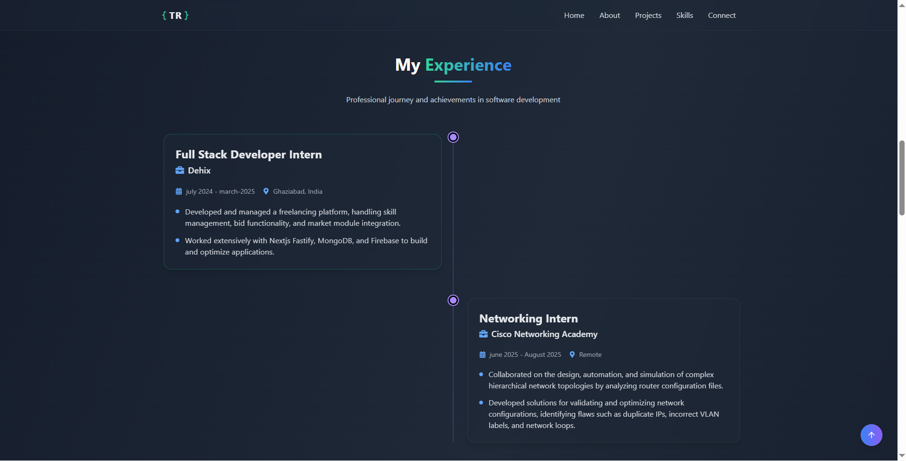

# MyPortfolio

A personal portfolio website built with React and Next.js, showcasing my skills, projects, and experience.

## Features

- Responsive design
- Project showcase
- Skill section
- About section
- Experience section
- Fast performance with Next.js

## Live Demo

[View Live Demo](https://my-portfolio-silk-eta-57.vercel.app/)


## Screenshots

Here are a few screenshots of the project:

| Home Page | Projects Page | Experience Section | Certificate Section |
|-----------|--------------|----------------|---------------|
|  |  |  |  |


## Installation

1. Clone the repository:
  ```bash
  git clone https://github.com/rtushar2708/My_Portfolio.git
  ```
2. Navigate to the project directory:
  ```bash
  cd MyPortfolio
  ```
3. Install dependencies:
  ```bash
  npm install
  ```
4. Start the development server:
  ```bash
  npm run dev
  ```
5. Open [http://localhost:3000](http://localhost:3000) in your browser.

## Technologies Used

- React
- Next.js
- TailwindCSS
- Frame Motion
- TypeScript

